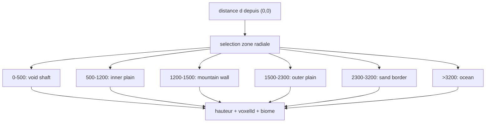

# Plan d’implémentation Atoll Abysse (profondeur massive)

## Paramètres validés
- Bornes radiales: `X=1200`, `Y=1500`, `Z=2300`, `W=3200`.
- Exigence profondeur: approche **refactor vertical massif** (représentation géométrique/procédurale profonde, pas simple illusion locale).
- Exigence de profondeur finale immédiate: le trou central doit descendre **directement** à `-20_000_000` dans cette implémentation (pas de palier transitoire).

## Cible topologique (Dimension_Abysse)
- `d ∈ [0,500]`: gouffre central, chute verticale, biome Néant/Roche sombre.
- `d ∈ (500,1200]`: sanctuaire intérieur (plaine autour de `Y≈20`).
- `d ∈ (1200,1500]`: muraille agressive (pics `+200` à `+700`, bruit 3D fort).
- `d ∈ (1500,2300]`: plaine extérieure descendante.
- `d ∈ (2300,3200]`: frontière sable vers niveau 0.
- `d > 3200`: océan profond.

## Axe A — Refactor vertical massif (fondation)
- Introduire une coordonnée verticale de chunk (`chunkY`) dans le pipeline serveur/client actuellement dominé par `(chunkX, chunkZ)`.
- Étendre les clés de stockage mémoire et persistance vers `(dimensionId, chunkX, chunkY, chunkZ)` dans:
  - [`c:\dev\Zero-K-Frozen-Legacy-main\Serveur\Monde_Serveur.cs`](c:\dev\Zero-K-Frozen-Legacy-main\Serveur\Monde_Serveur.cs)
  - [`c:\dev\Zero-K-Frozen-Legacy-main\Serveur\DonneesChunk.cs`](c:\dev\Zero-K-Frozen-Legacy-main\Serveur\DonneesChunk.cs)
- Faire évoluer le contrat réseau de demande/envoi chunk pour inclure `chunkY` dans:
  - [`c:\dev\Zero-K-Frozen-Legacy-main\NetworkManager.cs`](c:\dev\Zero-K-Frozen-Legacy-main\NetworkManager.cs)
  - [`c:\dev\Zero-K-Frozen-Legacy-main\Client\Monde_Client.cs`](c:\dev\Zero-K-Frozen-Legacy-main\Client\Monde_Client.cs)
- Adapter le routage dimensionnel déjà en place dans [`c:\dev\Zero-K-Frozen-Legacy-main\Gestionnaire_Monde.cs`](c:\dev\Zero-K-Frozen-Legacy-main\Gestionnaire_Monde.cs) pour des colonnes verticales multi-niveaux.

## Axe B — Générateur topologique Abysse exact
- Remplacer la fonction Abysse actuelle par une fonction par zones radiales stricte dans [`c:\dev\Zero-K-Frozen-Legacy-main\Serveur\Chunk_Serveur.cs`](c:\dev\Zero-K-Frozen-Legacy-main\Serveur\Chunk_Serveur.cs):
  - cœur: puits vertical massif,
  - muraille: bruit 3D haute fréquence + amplitude forte,
  - transitions courtes/violentes ou douces selon zone,
  - mapping explicite des `Voxel ID` par biome (Néant, Plaine, Montagne, Sable, Eau).
- Ajouter un masque de falaise quasi discontinu à `d≈500` pour la rupture brutale trou -> sanctuaire.
- Imposer une loi de profondeur du puits central avec cible immédiate `-20_000_000` (sans étape intermédiaire).

## Axe C — Streaming vertical et stabilité gameplay
- Étendre la logique de requêtes priorisées autour du joueur à un volume 3D (anneau radial + bande verticale).
- Mettre en place des garde-fous physiques pour la chute profonde (activation progressive collisions, budget de solidification vertical).
- Conserver le comportement dimensionnel demandé: jour permanent Abysse + TP rebord.

## Validation proposée
- Test radial: échantillonnage de plusieurs `d` (100, 700, 1300, 1900, 2600, 3600) et vérification altitude/biome attendus.
- Test vertical: chute au centre avec streaming continu des niveaux verticaux sans freeze fatal, et atteinte mesurée d’une profondeur `<= -20_000_000`.
- Test réseau: 2 peers en dimensions différentes, puis en Abysse à altitudes très différentes, sans mélange de chunks.
- Test persistance: sauvegarde/rechargement de chunks verticaux Abysse dans le bon namespace de dimension.